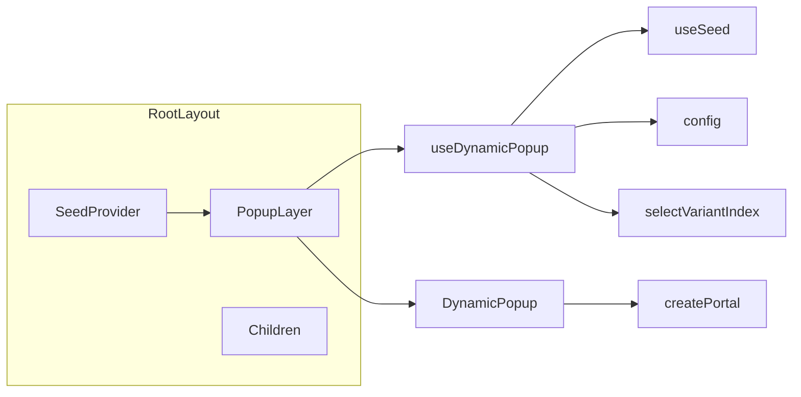

# V4 – Randomized Anti-Memorization Popups

V4 is a centralized popup/interstitial system that shows lightweight messages per site and per page with deterministic randomness so scrapers cannot memorize a single DOM. It plugs into the existing dynamic stack (seed-driven, flag-gated) without coupling popup logic to individual pages.

## Goals

- **Central control**: Declare popups and rules once; layout wraps content with a single `V4PopupLayer`; pages stay agnostic.
- **Anti-memorization**: Multiple templates, texts, and placements selected by seed; placement rotation (center, bottom-right, banner); timing jitter; optional multiple popups per page.
- **Non-invasive UX**: Close button, optional body copy, theme-aligned styling; Escape to close; accessible (focus, aria).
- **Easy rollout**: Enable/disable via `NEXT_PUBLIC_ENABLE_DYNAMIC_V4`; when V4 is off, no UI changes. Same surface area in every web (no shared package).

## Scope

- **Target**: All webs in the repo (14 total).
- **Reference implementation**: [web_1_autocinema](web_1_autocinema). The same pattern is applied to every web so V4 is consistent everywhere.
- **Webs**: `web_1_autocinema`, `web_2_autobooks`, `web_3_autozone`, `web_4_autodining`, `web_5_autocrm`, `web_6_automail`, `web_7_autodelivery`, `web_8_autolodge`, `web_9_autoconnect`, `web_10_autowork`, `web_11_autocalendar`, `web_12_autolist`, `web_13_autodrive`, `web_14_autohealth`.
- **Principle**: Each web has its own `src/dynamic/v4/`, shared flags + core updates, and layout wrapper. Popup on every page when V4 is enabled and seed ≠ 1 (no session cap); optionally more than one popup per page (e.g. up to `MAX_POPUPS_PER_PAGE`). Popup **content** (titles, body, CTAs) is **per-web** and meaningful to that domain (movies, books, hotels, mail, etc.).

## Architecture



- **V4PopupLayer**: Client component in layout; calls `useDynamicPopup(pageKey)`, renders `DynamicPopup` when `shouldShow` and `variant` are set. Derives `pageKey` from `usePathname()` (e.g. `"/"` → `"home"`, `"/movies/123"` → `"movies"`).
- **useDynamicPopup**: Uses `useSeed()`, `isV4Enabled()`, `selectVariantIndex()` from that web’s `shared/core` and `shared/flags`. Shows one popup on every page when V4 is enabled and seed ≠ 1 (no session cap). Picks popup by seed + pageKey + showIndex; supports multiple popups per page (e.g. re-show after dismiss, up to `MAX_POPUPS_PER_PAGE`). Resets when pageKey changes. Returns `{ shouldShow, variant, dismiss }`. Variant can include optional `body` for lengthy copy.
- **DynamicPopup**: Presentational component; receives `variant` (placement, title, body?, cta, popupId?) and `onClose`; uses theme colors (bg-card, border-border, text-muted-foreground, etc.); renders overlay + content via `createPortal(..., document.body)`; Escape to close; `data-v4="true"`. Placements: center, bottom-right, banner.

### File layout (per web)

| Path (relative to each web root) | Purpose |
|----------------------------------|--------|
| `src/dynamic/shared/flags.ts` | Add `isV4Enabled()`: `process.env.NEXT_PUBLIC_ENABLE_DYNAMIC_V4 === "true"`. |
| `src/dynamic/v4/config.ts` | **Customise per web.** `PopupDef` type and `POPUPS` with domain-specific titles, body, CTAs. Placements: `"center" \| "bottom-right" \| "banner"`. |
| `src/dynamic/v4/useDynamicPopup.ts` | Client hook: seed, pageKey, showIndex; no session cap; optional multiple per page. Return `{ shouldShow, variant, dismiss }`. |
| `src/dynamic/v4/DynamicPopup.tsx` | Client component: theme-aligned styling, portal, optional body, Escape, placements. |
| `src/dynamic/v4/index.ts` | Export `useDynamicPopup`, `DynamicPopup`, `POPUPS`, types. |
| `src/dynamic/shared/core.ts` | Add `v4: { isEnabled: () => isV4Enabled() }` to `useDynamicSystem()`. |
| `src/dynamic/index.ts` | Add `export * from "./v4";`. |
| `src/components/layout/V4PopupLayer.tsx` | Client component: pathname → pageKey (adapt to web routes), `useDynamicPopup(pageKey)`, render children + DynamicPopup when `shouldShow && variant`. |
| `src/app/layout.tsx` | Inside SeedProvider, wrap main content with `<V4PopupLayer>...</V4PopupLayer>`. |

## Per-web implementation checklist

Apply in **each** web directory. Use [web_1_autocinema](web_1_autocinema) as reference: copy files and adapt only web-specific parts.

| Step | Path | Action |
|------|------|--------|
| 1 | `src/dynamic/shared/flags.ts` | Add `isV4Enabled()` (same pattern as `isV1Enabled` / `isV2Enabled` / `isV3Enabled`). |
| 2 | `src/dynamic/v4/config.ts` | Create; export `PopupDef` and `POPUPS` with **domain-specific** titles, body, CTAs. Include `body` in texts for lengthy copy. |
| 3 | `src/dynamic/v4/useDynamicPopup.ts` | Create (copy from web_1). No session cap; popup on every page; optional multiple per page (showIndex, re-show after dismiss). |
| 4 | `src/dynamic/v4/DynamicPopup.tsx` | Create (copy from web_1). Theme-aligned (bg-card, border-border, text-card-foreground, focus:ring-ring). Portal, Escape, optional body. |
| 5 | `src/dynamic/v4/index.ts` | Create; export hook, component, config, types. |
| 6 | `src/dynamic/shared/core.ts` | Import `isV4Enabled`; add `v4: { isEnabled: () => isV4Enabled() }` to `useDynamicSystem()`. |
| 7 | `src/dynamic/index.ts` | Add `export * from "./v4";`. |
| 8 | `src/components/layout/V4PopupLayer.tsx` | Create. `usePathname()` → pageKey (adapt to this web’s routes). `useDynamicPopup(pageKey)`; render children + DynamicPopup when `popup.shouldShow && popup.variant`. |
| 9 | `src/app/layout.tsx` | Inside SeedProvider, wrap main content with `<V4PopupLayer>...</V4PopupLayer>`. |

**Web-specific customisation**

- **v4/config.ts**: Only file that **must** be customised per web. Popup `id`s and `texts` (title, body, cta) reflect the domain (movies, books, products, restaurants, CRM, mail, delivery, hotels, social, work, calendar, tasks, rides, health). Same structure as web_1 (delayMs, placements, multiple entries).
- **V4PopupLayer.tsx**: `pathnameToPageKey()` may need to match this web’s routes (e.g. `/matters`, `/clients` for autocrm; `/inbox` for automail). Default: first path segment or `"home"` for `/`.
- **DynamicPopup.tsx**: Can be copied as-is; theme tokens (bg-card, border-border, etc.) follow each web’s theme.

## Runtime flow

1. Layout renders `V4PopupLayer` inside `SeedProvider`.
2. `V4PopupLayer` gets `pageKey` from pathname (e.g. `"/"` → `"home"`).
3. `useDynamicPopup(pageKey)` runs: if `!isV4Enabled()` or seed === 1 → no popup.
4. Otherwise: resolve popup by seed + pageKey + showIndex; pick placement/text via `selectVariantIndex`.
5. Return `{ shouldShow, variant, dismiss }`. Render `<DynamicPopup variant={...} onClose={dismiss} />` in a portal.
6. User dismisses → optional re-show (up to `MAX_POPUPS_PER_PAGE`). State resets when `pageKey` changes.

## Configuration

- **Env**: `NEXT_PUBLIC_ENABLE_DYNAMIC_V4=true` to enable V4. No default in code (V4 off unless set).
- **Next.js**: Each web’s `next.config.js` can expose/default `ENABLE_DYNAMIC_V4` / `NEXT_PUBLIC_ENABLE_DYNAMIC_V4` for local dev (web_1 already does this).
- **Docker**: Dockerfiles use build-arg `ENABLE_DYNAMIC_V4` and `NEXT_PUBLIC_ENABLE_DYNAMIC_V4`; docker-compose and `scripts/setup.sh` pass V4 flags for all demos.
- **setup.sh**: Supports `--enabled_dynamic_versions=v1,v2,v3,v4` and exports V4 for every deployed web.

Recommended behaviour:

- Seed 1 = never show (keeps baseline unaffected).
- No session cap: popup on every page when enabled for maximum anti-memorization.
- Delay window per popup (e.g. 0.6–5.5s) to randomize timing across sessions.

## Example usage

**Layout integration (recommended):**

```tsx
// src/app/layout.tsx
<SeedProvider>
  <V4PopupLayer>
    <DataReadyGate>{children}</DataReadyGate>
  </V4PopupLayer>
</SeedProvider>
```

**V4PopupLayer (concept):**

```tsx
"use client";
import { usePathname } from "next/navigation";
import { useDynamicPopup, DynamicPopup } from "@/dynamic/v4";

function pathnameToPageKey(pathname: string): string {
  if (pathname === "/") return "home";
  const segment = pathname.split("/")[1];
  return segment || "home";
}

export function V4PopupLayer({ children }: { children: React.ReactNode }) {
  const pathname = usePathname();
  const pageKey = pathnameToPageKey(pathname);
  const popup = useDynamicPopup(pageKey);

  return (
    <>
      {children}
      {popup?.shouldShow && popup.variant && (
        <DynamicPopup variant={popup.variant} onClose={popup.dismiss} />
      )}
    </>
  );
}
```

**Using the centralized hook:**

```tsx
import { useDynamicSystem } from "@/dynamic";
import { DynamicPopup } from "@/dynamic/v4";

const dyn = useDynamicSystem();
const popup = dyn.v4.isEnabled() ? useDynamicPopup("movie-detail") : null;
// Then: popup?.shouldShow && <DynamicPopup variant={popup.variant} onClose={popup.dismiss} />
```

## Anti-memorization levers

- **Variantized IDs/classes/texts**: Per-web popup config; optional reuse of V3 maps.
- **Placement rotation**: center/modal vs. bottom-right vs. banner.
- **Template diversity**: Different CTA layouts (primary-only, two buttons, text-only); optional body paragraph.
- **Seeded randomness**: Same seed + pageKey yields consistent choice for that session; variety across seeds.
- **Timing jitter**: Seed-based delay window so popup appears at different moments.
- **Multiple per page**: Optional re-show after dismiss (up to `MAX_POPUPS_PER_PAGE`) to avoid single memorizable state.
- **Close button variation**: Can render in different corners per variant (if configured).

## Optional / deferred

- **Session cap / cooldown**: Not used in current plan; popup on every page (and optionally more per page) for maximum anti-memorization.
- **V3 text/ID reuse**: Per web, add popup-related keys to V3 text-variants (or a local map in v4) and use `getVariant(seed, key, ...)` for title/cta if desired.
- **pagePatterns**: In config, add `pagePatterns: string[]` and in the hook filter `POPUPS` by pathname for route-specific popups.

## Summary (per web)

| Item      | Action                                                                                       |
| --------- | -------------------------------------------------------------------------------------------- |
| Flag      | Add `isV4Enabled()` in `shared/flags.ts` (each web)                                          |
| Config    | New `v4/config.ts` with `PopupDef` and `POPUPS`; **domain-specific** titles, body, CTAs      |
| Hook      | New `v4/useDynamicPopup.ts` (copy from web_1): one popup per page, no session cap; optional multiple per page |
| Component | New `v4/DynamicPopup.tsx` (copy from web_1): theme-aligned, portal, optional body             |
| Exports   | New `v4/index.ts`; re-export from `dynamic/index.ts` (each web)                              |
| Core      | Add `v4: { isEnabled }` to `useDynamicSystem()` in `shared/core.ts` (each web)                |
| Layout    | New `V4PopupLayer.tsx` (pathname→pageKey adapted to web routes); wrap app content in `layout.tsx` |

**Rollout**: Apply the per-web checklist to each of the 14 webs. web_1_autocinema is the reference; for web_2 through web_14, add the same files and wiring, and customise only `v4/config.ts` (domain copy) and, if needed, `V4PopupLayer` pathname→pageKey mapping. When V4 is enabled and seed ≠ 1, a popup appears on every page (and optionally more on the same page), with seed-driven placement, text, and timing for agent-memorization resistance across all webs.

## Notes

- Keep payload light (no heavy images/fonts in popups).
- Respect accessibility: focus trap for modal placement, `aria-modal`, Escape to close.
- Ensure SSR safety: guard window/localStorage usage in hooks/store.
- When V4 is disabled, pages need no conditional logic; the hook returns no popup.
